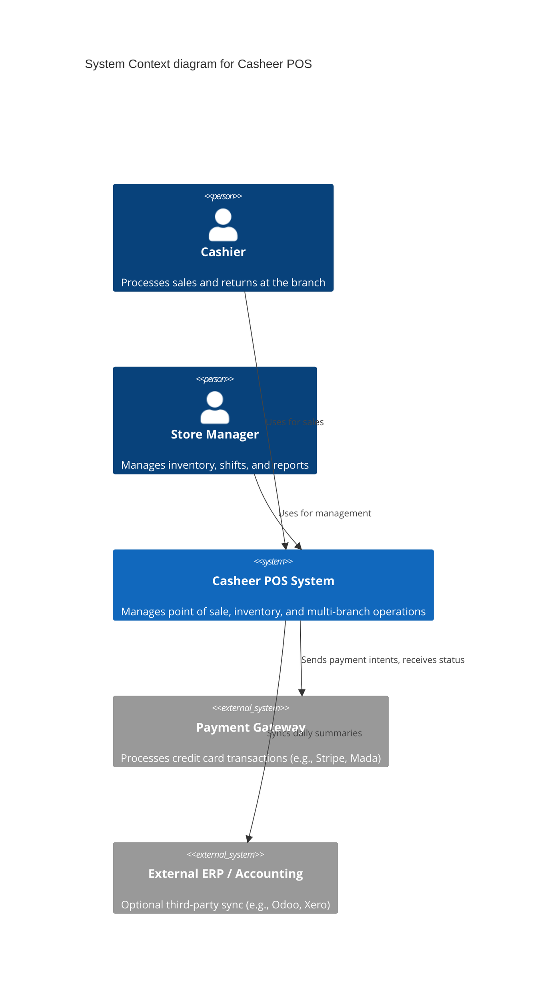
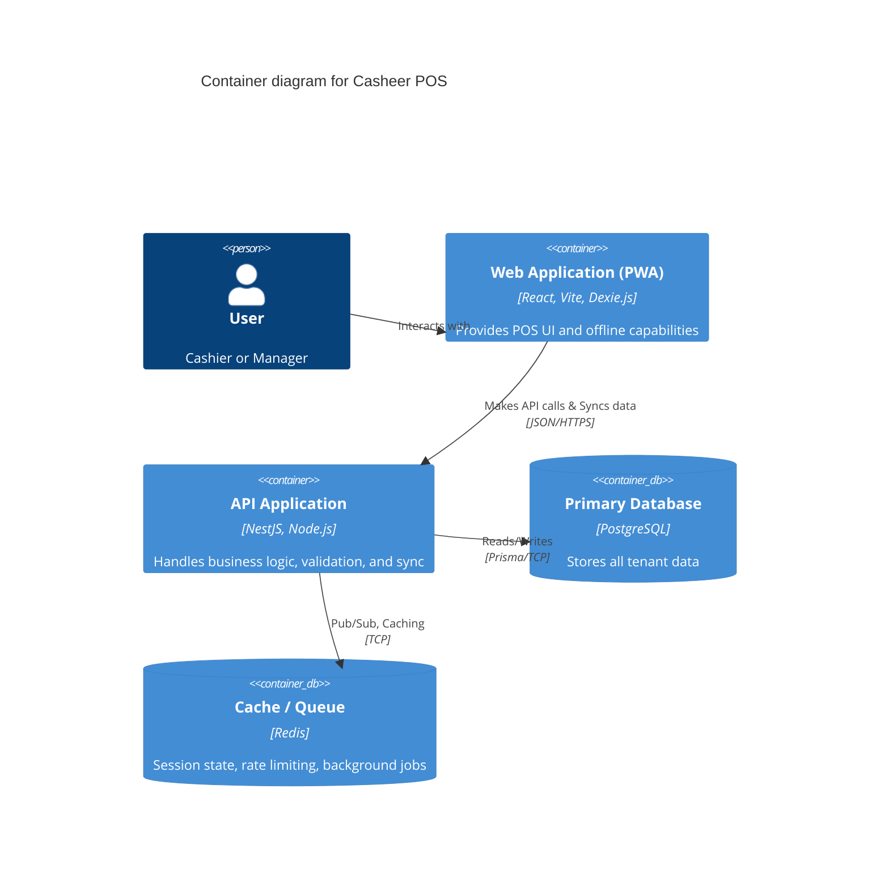
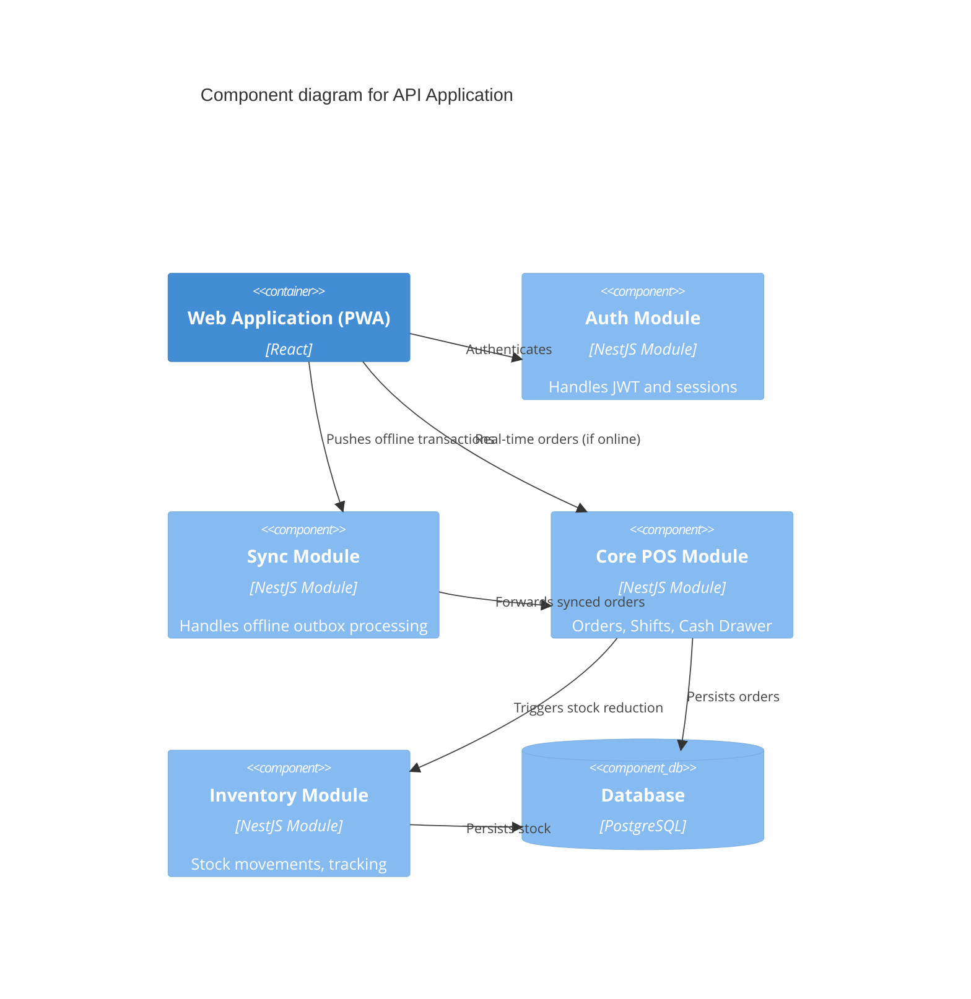

# 1. System Architecture Specification

## 1.1 Overall Architecture

Casheer follows a **Modular Monolith** architecture on the backend, paired with a **Smart Offline** (Local-First) Progressive Web Application (PWA) on the frontend. 

**Key Architectural Principles:**
1. **Strict Multi-Tenancy**: The system utilizes Logical Isolation within a shared PostgreSQL database. **PostgreSQL Row-Level Security (RLS) acts as the primary security boundary** to enforce tenant isolation at the database engine level, with Prisma middleware acting only as a secondary safeguard.
2. **Hardware Abstraction Layer**: The frontend interacts with peripherals (printers, scanners) via a strict abstraction layer. This ensures that while Phase 1 relies on Browser APIs, future implementations (e.g., native Electron bridges or local hardware daemons) can be swapped in without altering core business logic.

## 1.2 C4 Diagrams

### Level 1: System Context Diagram

### Level 2: Container Diagram

### Level 3: Component Diagram (API Application)

## 1.3 Data Flow (Offline Sync Request Lifecycle)

1.  **Action**: Cashier completes an order while offline.
2.  **Local Persistence**: PWA saves the order to IndexedDB (Dexie.js) via a local transaction.
3.  **Outbox Queue**: Order is appended to a local `sync_outbox` table.
4.  **UI Update**: User sees "Sale Complete" immediately.
5.  **Background Sync**: Service Worker detects internet restoration.
6.  **Transmission**: Payload is sent to `/api/v1/sync` endpoint with idempotency keys.
7.  **Backend Processing**:
    *   API verifies token and tenant.
    *   Extracts UUIDs from payload.
    *   Checks if UUID already exists (Idempotency).
    *   Executes Prisma transaction: Inserts Order, Deducts Inventory, Updates Shift totals.
8.  **Acknowledgment**: API returns `200 OK`. Client removes item from local outbox.

## 1.4 Deployment Architecture

*   **Frontend**: Hosted on Vercel/Netlify or served via Nginx globally via CDN.
*   **Backend**: Deployed as Docker containers via AWS ECS or Kubernetes.
*   **Database**: Managed PostgreSQL (e.g., AWS RDS).
*   **Cache**: Managed Redis (e.g., ElastiCache).
